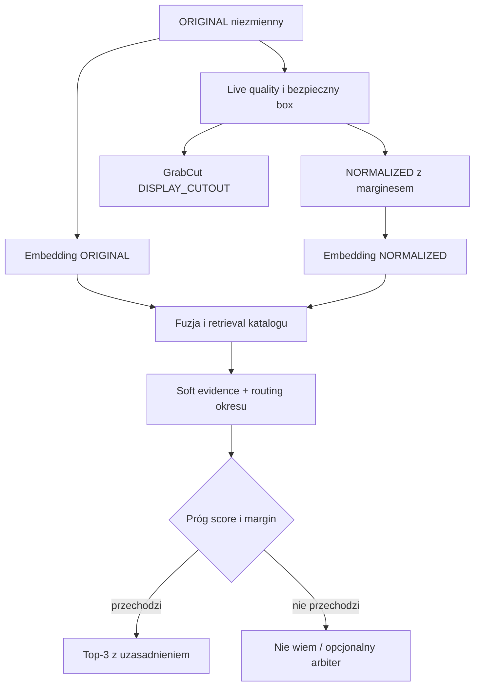

# APOMONET Vision v2 — raport decyzyjny LAB

- Data zamrożenia: 2026-09-30
- Gałąź: `codex/vision-lab-20260930`
- Punkt bazowy: `6d6a0e25f021123a7a8630cc471150db02d672c1` z `codex/visual-lab-20260910`
Zakres: laboratorium; bez wdrożenia, merge do `main`, zmian domen, produkcyjnych sekretów i danych użytkowników.

## Decyzja

APOMONET powinien **zmodyfikować, a nie zastąpić** obecny pipeline. Rdzeniem pozostają własny katalog, hierarchia wiedzy, retrieval i jawne soft scoring/abstention. Gotowe komponenty powinny przejąć zadania niższego poziomu: analizę kadru, bezpieczny box, lekką segmentację do UI oraz embedding obrazu.

Rekomendowany wariant v2:

1. zachować niezmienny `ORIGINAL`;
2. utworzyć `NORMALIZED` przez bezpieczny box z marginesem, bez usuwania tła;
3. rozpoznawać przez fuzję wyników SigLIP 2 dla `ORIGINAL + NORMALIZED` i katalog APOMONET;
4. traktować metadane tylko jako miękkie dowody, chyba że użytkownik je potwierdził;
5. generować `DISPLAY_CUTOUT` oddzielnie i asynchronicznie; w LAB pierwszym kandydatem jest OpenCV GrabCut, ale wynik nie spełnia jeszcze bramki produkcyjnej rantu;
6. zwracać „nie wiem”, gdy score i margines nie przechodzą kalibrowanych progów;
7. nie uruchamiać automatycznej migawki, dopóki quality gate nie przejdzie testu na fizycznych telefonach.

Najlepszy czysto wizualny wynik wyniósł **Top-1 47,67%, Top-3 67,14%, Top-5 73,83%**. To przewyższa zapisany SIFT rerank (30,6% / Top-5 54,9%) i osiąga poziom dawnej miękkiej hybrydy już bez metadanych, ale nadal nie uzasadnia automatycznej, kategorycznej identyfikacji.

## Co zostało zmierzone

### Zamrożony zbiór i brak leakage

- Przed testem wykorzystano, zamiast powtarzać, zapisany benchmark `visual-cross-specimen-500-2026-09-10`, raport recognition runtime, hierarchię katalogu, source registry/knowledge policy, gap-closure audit oraz przekazane checkpointy, audyt prawny i nadrzędne zasady jakości/testowania.
- Katalog runtime pozostaje częścią rozwiązania: 22 149 egzemplarzy źródłowych, 2785 typów nadrzędnych, 5926 emisji i 6291 odmian w hierarchii okres → emitent/władca → nominał → typ → emisja → odmiana → egzemplarz.
- Użyto istniejącego manifestu 500 typów; SHA-256: `2469a2a725c5c1d88ee5c3422a9c15070bb8e9623499694c827091930ff81714`.
- Bieżąco dostępne było 493 typy i 1971 poprawnych obrazów; 13 pobrań brakowało lub było niepoprawnych. Różnica względem historycznych 490/1960 wynika z dostępności hostów, a starego baseline'u nie uruchamiano ponownie.
- Zapytanie i referencja pochodzą z różnych rekordów egzemplarzy; identyczne URL-e zostały wykluczone.
- Obrazów nie zapisano w commicie. Nie pobierano źródeł RED/YELLOW poza istniejącą podstawą i nie obchodzono limitów ani zabezpieczeń.
- PRL nie ma w zamrożonym zbiorze dwóch legalnie dostępnych egzemplarzy tego samego typu, dlatego nie podajemy pozornej skuteczności recognition dla PRL. Jedna moneta PRL weszła tylko do kontrolowanego testu segmentacji.

### Baseline i współczesne embeddingi

| Metoda | Reprezentacja | Top-1 | Top-3 | Top-5 | p50 inferencji / obraz CPU |
|---|---|---:|---:|---:|---:|
| historyczny pHash | zapisany baseline | 2,0% | — | — | — |
| historyczny HOG | zapisany baseline | 27,6% | — | — | — |
| historyczny ResNet18 | zapisany baseline | 27,1% | — | — | — |
| historyczny global fusion | zapisany baseline | 29,8% | — | — | — |
| historyczny SIFT rerank | zapisany baseline | 30,6% | — | 54,9% | — |
| DINOv2 Small | ORIGINAL | 40,57% | 63,89% | 71,20% | 310,46 ms |
| DINOv3 Small | NORMALIZED | 36,92% | 58,01% | 65,72% | 47,21 ms |
| SigLIP 2 Base | ORIGINAL | 41,99% | 65,92% | 72,82% | 99,87 ms |
| SigLIP 2 Base | NORMALIZED | 43,81% | 64,71% | 73,02% | 101,58 ms |
| SigLIP 2 Base | DISPLAY_CUTOUT | 42,60% | 61,66% | 70,18% | 100,87 ms |
| **SigLIP 2 Base** | **fuzja ORIGINAL + NORMALIZED** | **47,67%** | **67,14%** | **73,83%** | dwa embeddingi; sam ranking pomijalny względem inferencji |
| MobileNetV4 Small | NORMALIZED | 31,85% | 52,13% | 58,82% | 1,85 ms |

Wniosek: nie ma jednej reprezentacji, która bezwarunkowo zastępuje oryginał. `NORMALIZED` pomaga SigLIP, ale szkodzi DINOv2; najlepsza jest fuzja dwóch niezależnych widoków. `DISPLAY_CUTOUT` pogarsza wynik każdego przetestowanego nowoczesnego backbone'u względem jego najlepszego wejścia.

### Metric learning

Metric learning otrzymał trudniejszy, prawidłowy protokół: 391 typów train i 102 niewidziane typy test, bez dopasowania do tożsamości testowych, z różnymi egzemplarzami query/reference.

| Wariant na tych samych 102 typach | Top-1 | Top-3 | Top-5 |
|---|---:|---:|---:|
| surowy embedding DINOv3 | 55,88% | 77,45% | 86,27% |
| uczona projekcja 128D | 44,12% | 65,69% | 76,47% |

Projekcja obniżyła Top-1 o 11,76 pp. Test nie daje podstaw do budowy własnego Siamese/projection head. Liczb z tego 102-typowego podzbioru nie należy porównywać wprost z pełnym rankingiem 493 kandydatów; miarodajna jest różnica raw kontra learned w tym samym protokole.

### OCR i miękkie metadane

Lokalny Tesseract 5.3.4, cztery obroty, nie dał wartości użytkowej:

- jakikolwiek rok: 2,23% zapytań;
- rok dokładny: 0,41%; rok błędny: 1,83%;
- OCR-only: Top-1 0,25%, Top-3/5 0,51%;
- tuner wybrał wagę wizualną 1,0, więc OCR nie poprawił retrieval;
- koszt: p50 805,84 ms, p90 1169,33 ms na typ.

Generyczny OCR wypada z domyślnej ścieżki. Może wrócić dopiero jako wyspecjalizowany odczyt legendy/roku, po osobnym benchmarku krzywizny i pisma historycznego. Nigdy nie może być hard veto.

Hybryda z **czystymi polami katalogowymi zapytania** osiągnęła Top-1 93,65%, Top-3 98,98%, Top-5 99,49%. Jest to wyłącznie sufit dla metadanych potwierdzonych przez użytkownika lub inne wiarygodne źródło, a nie wynik automatycznego OCR. Przy celowo błędnym jednym polu soft scoring zachował Top-1 79,70% dla roku, 87,56% dla nominału i 88,83% dla mennicy; potwierdza to odporność miękkiego scoringu, ale pozostałe pola były nadal czyste.

### Bezpieczne „nie wiem”

Dla najlepszej fuzji SigLIP progi ustalono na oddzielnych 99 zapytaniach kalibracyjnych i oceniono na 394:

- poprawna zaakceptowana odpowiedź: 7,87%;
- błędna odpowiedź pewna: 1,78%;
- abstention dla znanej monety: 90,36%;
- poprawne odrzucenie symulowanej monety spoza katalogu: 95,18%;
- błędna akceptacja poza katalogiem: 4,82%.

To bezpieczny, ale bardzo zachowawczy punkt pracy. Nie wolno obniżać abstention tylko dla lepszego UX bez osobnego celu false-confident i kalibracji na większym zbiorze. Dla czystych, potwierdzonych metadanych poprawna akceptacja rośnie do 40,86% przy 0,76% błędnych pewnych odpowiedzi, lecz false accept OOD wynosi 9,39%.

## Photo / segmentation bake-off

Kontrolowany benchmark objął 28 legalnych źródeł × 10 scenariuszy = 280 ramek: jasne/ciemne/wzorzyste tło, cień, odblask, prześwietlenie, niewielki i silny kąt, rozmycie oraz obcięty rant. Było 18 monet okrągłych i 10 nieregularnych, cztery ciemne oraz materiały srebrne, bilonowe, Nordic Gold, mosiądz, cynk, nikiel, brąz i miedź. Nie było reprezentatywnej monety ze złota.

| Metoda | IoU | recall monety | recall pasa rantu | pozostawione tło | ramki z utratą rantu | p50 / p90 CPU |
|---|---:|---:|---:|---:|---:|---:|
| APOMONET local CV | 0,8817 | 0,9593 | 0,9334 | 0,0234 | 23,57% | 13,51 / 15,32 ms |
| **OpenCV GrabCut** | **0,9436** | **0,9740** | **0,9484** | 0,0087 | **17,14%** | 338,60 / 760,89 ms |
| MobileSAM + lokalny box | 0,8500 | 0,8628 | 0,5644 | 0,0862 | 99,29% | 749,06 / 976,01 ms |
| MobileSAM + box oracle | 0,9569 | 0,9677 | 0,6209 | 0,0021 | 99,29% | 731,67 / 964,97 ms |
| SAM 2.1 Tiny + lokalny box | 0,8166 | 0,8257 | 0,6999 | 0,0584 | 93,93% | 1272,08 / 1404,04 ms |
| SAM 2.1 Tiny + box oracle | 0,9544 | 0,9598 | 0,7809 | 0,0014 | 97,50% | 1261,59 / 1390,13 ms |

Duże IoU SAM nie oznacza zachowania całego rantu: modele często podcinają cienki zewnętrzny pas. Box oracle silnie poprawił IoU na trudnym tle, więc detekcja/kadrowanie jest głównym wąskim gardłem. GrabCut wygrał ten test, ale protokół kompozytowy sprzyja klasycznemu foreground extraction; wynik jest wyborem do następnego etapu LAB, nie dowodem gotowości produkcyjnej.

Lokalny box APOMONET obejmował średnio 98,21% monety, lecz pełny rant zachował tylko w 88,93% ramek; fallback uruchomił się w 11,43%. Z tego powodu żaden testowany detektor/segmentator nie spełnia jeszcze bramki produkcyjnej „nie obcinaj monety”.

### Quality gate i automatyczna migawka

Obecny lokalny quality gate osiągnął 55,71% poprawnych decyzji i wykrył tylko 8,04% złych ramek. Przyjmował 87,5% dobrych, lecz pozorna gotowość auto-capture 89,29% wynika głównie z przepuszczania złych przypadków. Automatyczna migawka **nie jest gotowa**. Potrzebny jest test live na telefonach z natywnymi sygnałami ostrości, stabilności, ekspozycji, box tracking i perspektywy.

## Wyniki według okresów

Najlepsza wspólna fuzja SigLIP `ORIGINAL + NORMALIZED`:

| Okres | Typy | Top-1 | Top-3 | Top-5 | Wniosek |
|---|---:|---:|---:|---:|---|
| II RP i wojna | 39 | 61,54% | 82,05% | 84,62% | obraz działa dobrze; potwierdzony rok i nominał są wartościowe |
| III RP | 28 | 53,57% | 64,29% | 67,86% | mała próba; rok/nominał pomagają tylko po wiarygodnym odczycie |
| PRL | 0 cross-specimen | — | — | — | brak podstaw do oceny; konieczne legalne pary różnych egzemplarzy |
| zabory/powstania | 73 | 67,12% | 86,30% | 90,41% | najlepsza grupa wizualna |
| monarchia elekcyjna | 213 | 41,31% | 63,85% | 71,36% | potrzebne legenda/władca/mennica jako miękkie dowody |
| Jagiellonowie | 70 | 40,00% | 61,43% | 70,00% | potrzebne symbole/herby, legenda i typologia katalogu |
| średniowiecze | 70 | 44,29% | 55,71% | 64,29% | geometria i referencje ważniejsze od generycznego OCR |

Tuning nie wybrał różnych wag obrazu per okres: we wszystkich grupach optimum na tej próbie wyniosło 0,5 dla eksperymentu z czystymi metadanymi. Nie ma więc dowodu, że należy utrzymywać siedem osobnych modeli obrazu. Jest natomiast dowód, że skuteczność i wartość sygnałów różnią się; wspólny backbone powinien mieć okresowe progi pewności, zasady pozyskiwania dowodów i reranking.

W ablacjach czystych metadanych usunięcie roku obniżało Top-1 najmocniej (np. III RP 68,18→54,55; monarchia elekcyjna 94,71→52,94), a usunięcie nominału szkodziło II/III RP. Nie oznacza to, że rok z Tesseracta jest dobry — benchmark OCR dowodzi czegoś przeciwnego. Masa/średnica, legenda i herby nie miały wiarygodnych wartości query w tym zbiorze, więc nie przypisujemy im sztucznej liczby; powinny wejść jako miękkie, jawnie pochodzące dowody w następnym benchmarku.

## Odpowiedzi na 12 pytań właściciela

1. **Pipeline zdjęcia:** zmodyfikować. Zachować oryginał i bezpieczne CV; rozdzielić obraz analityczny od estetycznego cutoutu.
2. **Wykrycie/kadrowanie:** dziś lokalny OpenCV box z większym marginesem i obowiązkową kontrolą krawędzi; docelowo natywne śledzenie boxa przez ML Kit/MediaPipe/Apple Vision po teście urządzeń. SAM nie powinien pełnić roli detektora. Gdy box dotyka krawędzi lub pewność jest niska, żądać ponownego zdjęcia, a nie przycinać.
3. **Segmentacja/DISPLAY_CUTOUT:** OpenCV GrabCut jako pierwszy kandydat LAB, z rozszerzeniem maski i walidacją rantu; local CV jako szybki fallback. Nie promować jeszcze do produkcji. MobileSAM/SAM 2.1 przegrały na zachowaniu rantu i czasie.
4. **Obraz do recognition:** równolegle `ORIGINAL` i `NORMALIZED` z bezpiecznym marginesem; fuzja score. Nigdy sam `DISPLAY_CUTOUT`.
5. **Wpływ preprocessingu:** zależy od backbone'u. SigLIP normalized poprawia Top-1 41,99→43,81, ale dopiero fuzja daje 47,67. Cutout pogarsza Top-3/5 i nie może być wejściem domyślnym.
6. **Jeden pipeline dla wszystkich okresów:** jeden wspólny backbone tak; jedna polityka dowodów i progi — nie. Routing ma sterować thresholdami, pytaniami do użytkownika i soft scoringiem. Brakuje dowodu na osobne modele oraz danych PRL.
7. **Najlepszy mechanizm Top-1/Top-3 i „nie wiem”:** SigLIP 2 `ORIGINAL + NORMALIZED` + katalogowy shortlist + kalibrowane score/margin. Czysto wizualnie 47,67/67,14; bezpieczny punkt pracy ma 1,78% false-confident oraz 95,18% poprawnego abstention OOD, kosztem 90,36% abstention dla znanych.
8. **Metric learning:** nie daje przewagi. Na identycznym zbiorze niewidzianych typów obniżył Top-1 55,88→44,12.
9. **Build vs buy:** użyć gotowych OpenCV, natywnych SDK urządzeń, timm/SigLIP i standardowego runtime; własne pozostawić katalog, politykę źródeł, retrieval index, scoring, routing i confidence. Nie kupować teraz Roboflow. Numista i multimodalny model pozostają opcjonalnym, mierzalnym arbitrem dopiero po zgodzie na koszt/warunki.
10. **Czas i koszt:** jeden kadr wymaga około 13,5 ms detekcji + 99,9 ms ORIGINAL + 101,6 ms NORMALIZED, czyli około 215 ms p50 CPU przed narzutem I/O/rankingu; p90 z sumy zmierzonych etapów to około 230 ms. Dwie strony to odpowiednio około 0,43/0,46 s. DISPLAY_CUTOUT dodaje asynchronicznie 339/761 ms p50/p90 na kadr. Lokalny marginalny koszt API wynosi 0 EUR, ale pozostaje koszt infrastruktury/energii. OCR dodawał 0,81/1,17 s p50/p90 i został usunięty. Numista wymaga 100 EUR aktywacji, 100 EUR minimum miesięcznie po pierwszym miesiącu i od 0,030 EUR/request; nie uruchomiono go. Koszt modelu multimodalnego zależy od tokenów obrazu/tekstu i musi być logowany per wywołanie.
11. **Architektura docelowa:** trzy reprezentacje, wspólny embedding retrieval, własny katalog i miękkie dowody, okresowa polityka, jawne confidence/abstention oraz opcjonalny arbiter tylko na ogonie niepewności. Cutout jest osobną gałęzią UI.
12. **Minimalna migracja:** (a) utrzymać obecny kod produkcyjny, (b) wykonać fizyczny mobile bake-off na urządzeniach i uzupełnić PRL/złoto, (c) uruchomić v2 w trybie offline/shadow wyłącznie na legalnym zbiorze/za zgodą, (d) przejść bramki jakości i prywatności, (e) dopiero potem mały feature flag z natychmiastowym rollbackiem. Ten checkpoint niczego nie wdraża ani nie merguje.

## Docelowy przepływ Vision v2

## Bramy przed jakimkolwiek wdrożeniem

1. Co najmniej dwa fizyczne urządzenia Android i dwa iPhone'y; pomiar p50/p90, RAM, energii i temperatury.
2. Ślepy zbiór prawdziwych zdjęć obejmujący obcięty rant, klipy, cienkie monety, ciemną patynę, prawdziwe złoto, srebro z odblaskiem i wzorzyste tło.
3. Full-rim preservation ≥99,5% dla `NORMALIZED`; quality gate bad-frame recall ≥95%; żadnej auto-migawki wcześniej.
4. Osobny PRL cross-specimen oraz minimalna liczebność okresów do kalibracji thresholdów.
5. False-confident ≤1% na ślepym in-catalog i false accept OOD ≤2%, albo jawna decyzja właściciela o innym ryzyku.
6. Przegląd licencji checkpointu SigLIP/timm, polityki prywatności, retencji arbitra i zgody użytkownika.
7. Numista/SAM 3.1/OpenAI tylko po właściwej zgodzie płatniczej/licencyjnej i osobnym, zapisanym benchmarku.

## Ograniczenia

- Segmentacja była kontrolowanym benchmarkiem kompozytowym; nie zastępuje ślepego testu telefonu.
- Czas CPU nie przewiduje bezpośrednio czasu NNAPI/CoreML.
- Nie zmierzono PRL recognition ani prawdziwej złotej monety.
- Multimodalny arbiter i Numista nie zostały wywołane: wymagałyby płatnego użycia/klucza i decyzji właściciela. Nie przypisujemy im niezmierzonej jakości.
- Clean metadata hybrid jest sufitem przy znanych poprawnych polach, nie wynikiem automatycznej identyfikacji.
- Założone czasy końcowe sumują zmierzone etapy sekwencyjne; pełny end-to-end z dekodowaniem, I/O i indeksem należy jeszcze zmierzyć na docelowym runtime.

## Artefakty

- `lab/config/vision-v2-benchmark-2026-09-30.json` — zamrożona konfiguracja, wersje i hashe.
- `lab/results/vision-v2-retrieval-2026-09-30.json` — ranking, okresy, confidence i metric learning.
- `lab/results/vision-v2-segmentation-2026-09-30.json` — maski, rant, tło, scenariusze i czasy.
- `lab/results/vision-v2-ocr-2026-09-30.json` — realny lokalny OCR i jego wpływ.
- `lab/results/vision-v2-technology-research-2026-09-30.md` — licencje, prywatność, ceny i lock-in.
- `scripts/lab-vision-v2-*.py` — odtwarzalne skrypty LAB.

**Status końcowy:** rekomendacja laboratoryjna gotowa. Produkcja pozostaje nietknięta; następny krok wymaga osobnego mobile/real-photo gate, nie merge'u tego LAB-u.
